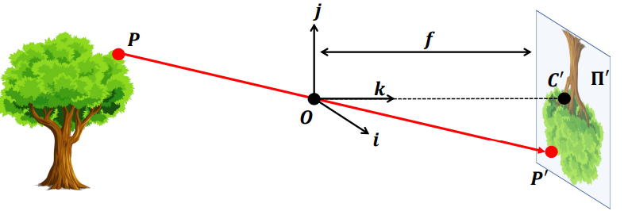
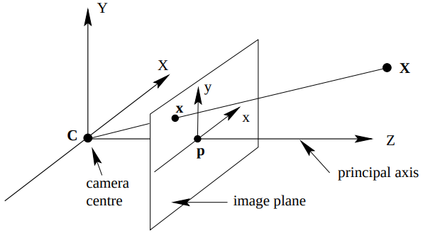
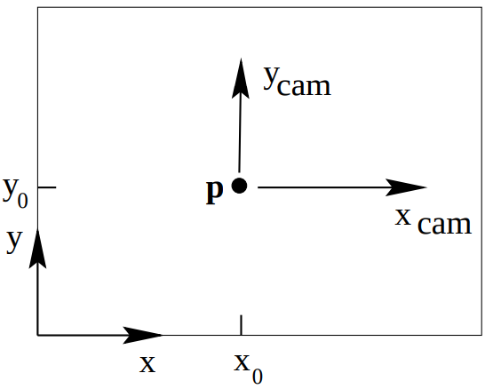
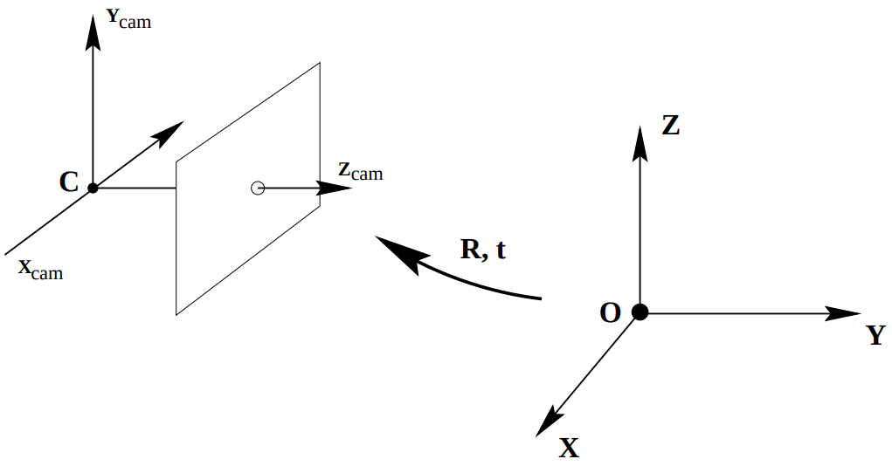
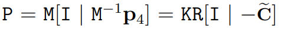

## Camera Models[^ 1]

### Pinhole

<figure>
   
    <figcaption>Fig 1: A formal construction of the pinhole camera model.  <a href="https://web.stanford.edu/class/cs231a/course_notes/01-camera-models.pdf">source</a></figcaption></figure>

This is a very simple model, besides the \\( \Pi'\\), the **image** or **retinal plane** is an important notion, the distance between it and the pinhole \\(O\\)  is focal length \\(f\\). The another core idea is the **virtual image** , which is upright. Or we can say that, we place the image plane **in front of**  the camera centre like the `Fig 2` for coordinate simplicity.

<figure>
 
    <figcaption>Fig 2: Camera space, virtual image plane. (Source: Multiple View Geometry in Computer Vision)</figcaption></figure>

- **Object in Camera Coordinate :**

$$
X = \begin{bmatrix}
x & y & z 
\end{bmatrix}^T
$$

- **Image in Camera Coordinate**:

$$
X' = \begin{bmatrix}
f \frac{x}{z} & f \frac{y}{z} & f 
\end{bmatrix}^T
$$

- **Ignoring the final coordinate :**
  $$
  X' = \begin{bmatrix}
  f \frac{x}{z} & f \frac{y}{z}
  \end{bmatrix}^T
  $$

- **Homogeneous coordinates :**
  
  
  $$
  \begin{bmatrix}
  x \\\ y \\\ z \\\ 1
  \end{bmatrix}
  \rightarrow
  \begin{bmatrix}
  fx \\\ fy \\\ z 
  \end{bmatrix} =
  \begin{bmatrix}
  f & 0 & 0 & 0 \\\
  0 & f & 0 & 0 \\\
  0 & 0 & 1 & 0 
  \end{bmatrix}
  \begin{bmatrix}
  x \\\ y \\\ z \\\ 1
  \end{bmatrix}
  $$
  

- Another form:
  $$
  \mathtt{P} = \mathtt{diag}(f, f, 1)[\mathtt{I} | 0]
  $$
  
- **Principal point offset**

  <figure>
  
      <figcaption>Fig 3: Image (x,y) and Camera (x_cam, y_cam)(Source: Multiple View Geometry in Computer Vision)</figcaption></figure>

  $$
  \begin{bmatrix}
  x \\\ y \\\ z \\\ 1
  \end{bmatrix} \mapsto
  \begin{bmatrix}
  fx \\\ fy \\\ z 
  \end{bmatrix} =
  \begin{bmatrix}
  f & 0 & p_x & 0 \\\
  0 & f & p_y & 0 \\\
  0 & 0 & 1 & 0 
  \end{bmatrix}
  \begin{bmatrix}
  x \\\ y \\\ z \\\ 1
  \end{bmatrix}
  $$
  
- Camera calibration matrix:
  $$
  \mathtt{K} =
  \begin{bmatrix}
  f & 0 & p_x  \\\
  0 & f & p_y  \\\
  0 & 0 & 1 &  
  \end{bmatrix} \\\
  X = \mathtt{K}[\mathtt{I} | 0]x_{\text{cam}}
  $$
  
- **Camera rotation and translation.**

  <figure>
  
      <figcaption>Fig 4: The Euclidean transformation between the world and camera coordinate frames.(Source: Multiple View Geometry in Computer Vision)</figcaption></figure>

  - C is the centre of camera system
  - \\(\tilde{X}_{\text{cam}} = R (\tilde{X} - \tilde{C})\\)

$$
X_{\text{cam}} = 
\begin{bmatrix}
    R & -R \tilde{C} \\\
    0 & 1
\end{bmatrix} 
\begin{bmatrix}
    X \\\ Y \\\ Z \\\ 1
\end{bmatrix} =
\begin{bmatrix}
    R & -R \tilde{C} \\\
    0 & 1
\end{bmatrix} X
$$

## Calibration

- [Charge-coupled device](https://en.wikipedia.org/wiki/Charge-coupled_device): CCD

## Reference

[^ 1]: [CS231A Course Notes 1: Camera Models](https://web.stanford.edu/class/cs231a/course_notes/01-camera-models.pdf)

[^ 2 ]:  [Multiple View Geometry in Computer Vision](https://doi.org/10.1017/CBO9780511811685)