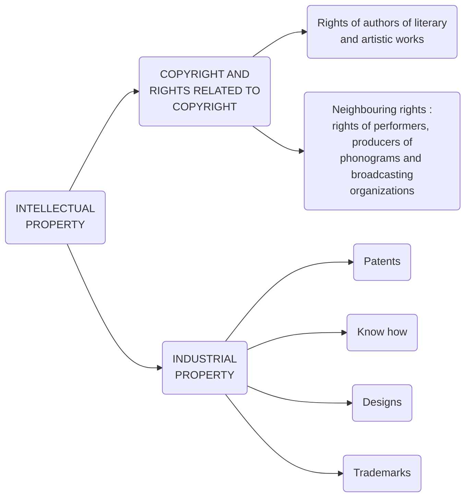
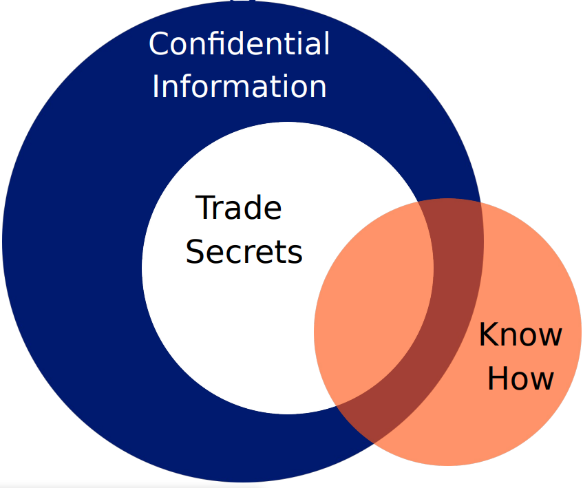

## GenAI and copyright

- patent law
- trade secret

### What’s the purpose of copyright?

Promote the advancement of arts and sciences by encouraging creation, investment and sharing

### Measuring Fair Use: The Four Factors

1. the purpose and character of your use
2. the nature of the copyrighted work
3. the amount and substantiality of the portion taken
4. the effect of the use upon the potential market.

### Fundamental rights

- Many 'rights' entries are omitted here...
- Some rights are absolute Others are not, and can be balanced against other rights. The balancing is called the **proportionality test**.

### Proportionality test

- Applies when rights come into conflict

- Transparency
- Explainability

---

---

## Introduction to IP principes

**Several IP rights on the same object**

- patent
- trade mark
- know how
- data base
- design 
- software

### Definition of IP

- Intellectual property rights are the rights given to persons over the creation of their mind
- IP rights usually give the creator an exclusive right over the use of their creation for a certain period of time

### Intellectual Property

### Some Organization

- **WIPO** 

-  **TRIPS**: 

- **APIPO**

- **EUIPO** , **EPO**

  

### Duration

| Item      | Duration                                                 |
| --------- | -------------------------------------------------------- |
| Copyright | at least 50 yr in France, 70 years after author's death. |
| Patent    | 20 years                                                 |
| Trademark | 10 yr, renewed indefinitely                              |
| Design    | 5 yr, 5 yr renewable with total 25 yr                    |

---

---

## PATENT INVENTION

- **Invention**: a technical solution that solves a technical problem

- The owner acquires the rights to prohibit any third-party operation for a period of generally 20 years and in the countries where the annuities (fees) are paid. 
- The owner has to describe his invention sufficiently to be able to be applied by those skilled in the art
- The description of the invention will be published 18 months after the filling.

**filing**: national, regional, international

**PCT**: Patent Cooperation Treaty

**Infringement**: Operate in a country, an object covered by a patent (at least a claim) in force in that country, without agreement of the owner

**The covered acts are**: manufacturing, offering , placing on the market, using, importing, exporting, transshipment or holding (device/process)

**IP5 countries** (Five Intellectual Property Offices)

- EPO
- JPO
- KIPO
- CNIPA
- USPTO

---

---

## PATENT INVENTION 

### Different classifications

- IPC : International Patent Classification 
- CPC : Cooperative Classification (EPO + USPTO) 
- FI : File Index (JPO – Japan Patent Office)

---

---

## Employees' inventions Know-how Business secrets regime Confidential information

### EMPLOYEE’S INVENTION

- France Regime

  - Within mission

  - Out of mission

- Germany Regime
  - Service inventions
  - Free inventions 

- US Regime
  - The employee has a right to the patent
- JAPAN REGIME
  - Reasonable remuneration to the employee.
- UK REGIME
  - Invention made by an employee in the normal course of their employment is owned by the employer 

### KNOW HOW - TRADES SECRETS - CONFIDENTIAL INFORMATION

**A CONFIDENTIAL INFORMATION :**

It is an information that is not publicly available, may or may not have commercial value, is communicated in confidence, and is reasonably protected

**TRADE SECRETS :**

It is a specific type of Confidential Information that has actual or potential economic value and/or provides a competitive advantage by virtue of its secret nature and reasonable efforts are taken by the owner to keep it secret.

**KNOW HOW :**

Unlike confidential information or trade secrets, may or may not be confidential. The term, encompasses skills or other types of knowledge, typically acquired through experience, that provide an advantage to the person using it or an entity that controls/owns it (similar to trade secrets). May be confidential or not.

#### TWO TYPES OF TRADE SECRETS

- Valuable information that do not meet the patentability criteria (commercial information, manufacturing processes not sufficiently inventive)
- Inventions that fulfill the patent criteria, could be protected by a patent. Choise of the company to keep it secret

---

---

## Software IP protection and copyright

---

---

## Contracts and IP

### MAIN CLAUSES OF A CONTRAT

- Recitals (ie the context of the agreement) 
- The parties 
- Definitions of the terms employed in the agreement 
- Object of the contract : purpose of the contract 
- Entry into force and duration, Rules for contract renewal 
- Obligations of the parties / Price / Payment
- Subcontracting 
- Warranties 
- Liability 
- Force majeure : circumstances going beyond the control of the parties under which they are allowed not to performe their obligations under the contract. 
- Applicable law / dispute resolution

**NEGOTIATION PHASE**

- **Non-disclosure agreements** (NDA)
- Memorandum of understanding (MOU)

#### NEGOTIATION PRINCIPLES

---

---

## Some quiz

- https://www.wipo.int/about-ip/en/quiz.html
- https://global.oup.com/uk/orc/law/company/jonesibl3e/student/mcqs/ch19/
- https://testbook.com/objective-questions/mcq-on-intellectual-property-rights-iprs--5fc42b81a1bc541cc2ffd6f0
- 