# Basic

## Statistical Supervised Learning in a nutshell

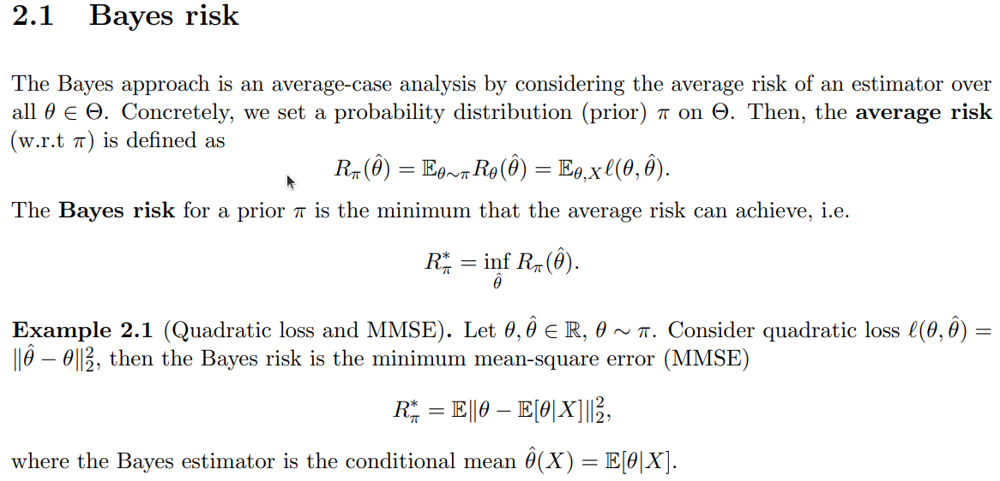

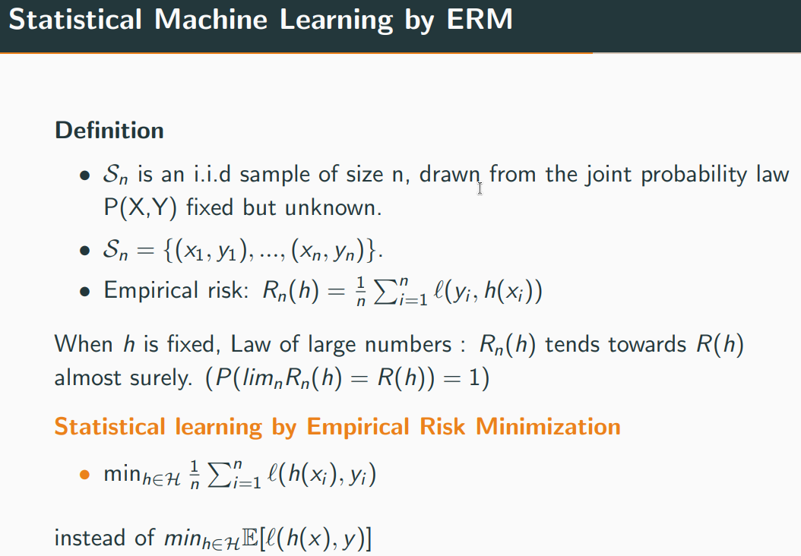

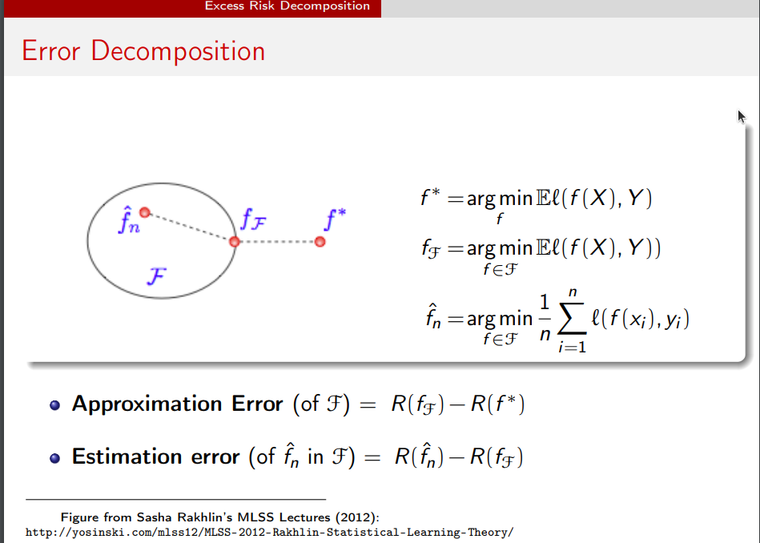

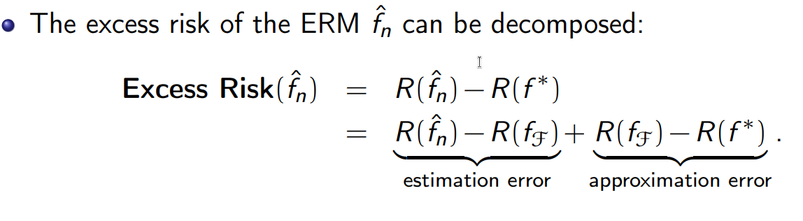

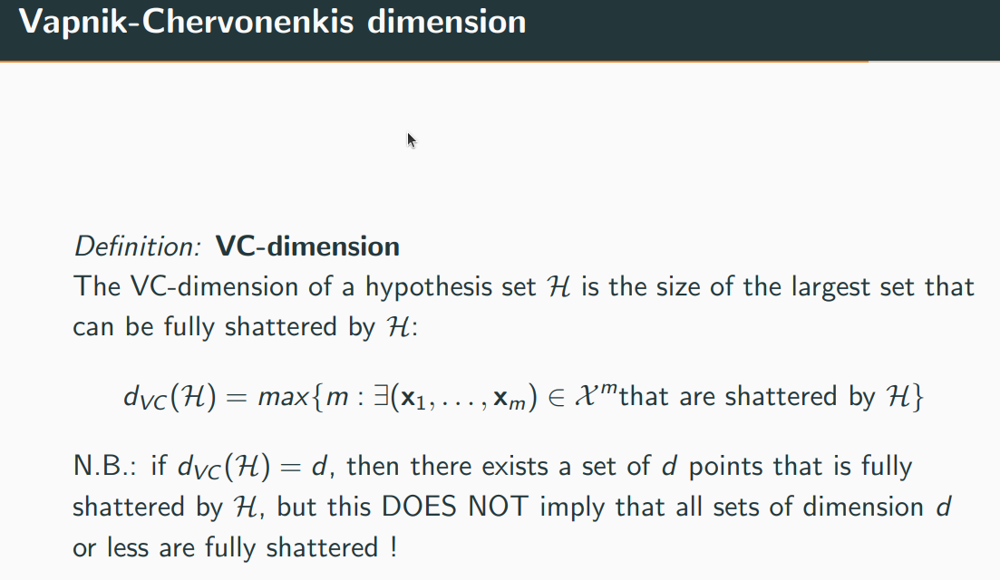
$$
d_{VC}(\text{hyperplane}) = d + 1
$$

**PAC** Probably Approximately Correct

Valiant introduced PAC learning. Galton introduced Linear Regression. Quinlan introduced the Decision Tree. Bayes introduced Bayes’ rule and Naïve-Bayes theorem.

Explanation: A concept is PAC learnable by L if L can output a hypothesis with error < epsilon. Hence the maximum error obtained by the hypothesis should be less than epsilon. Epsilon is usually 5% or 1%.

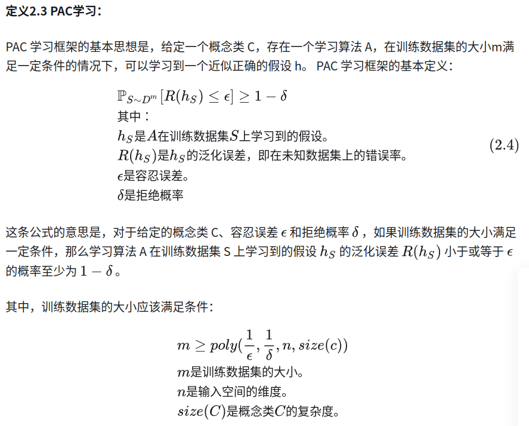

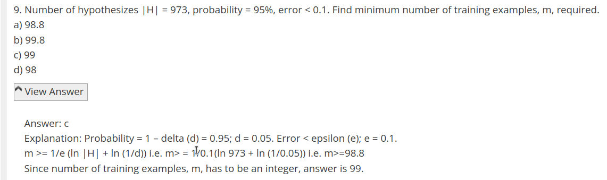

- Giving an upper bound to the size of the training set can **reduce overfitting**

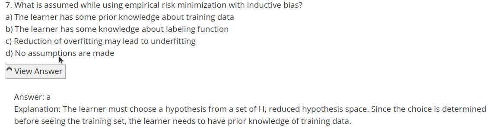

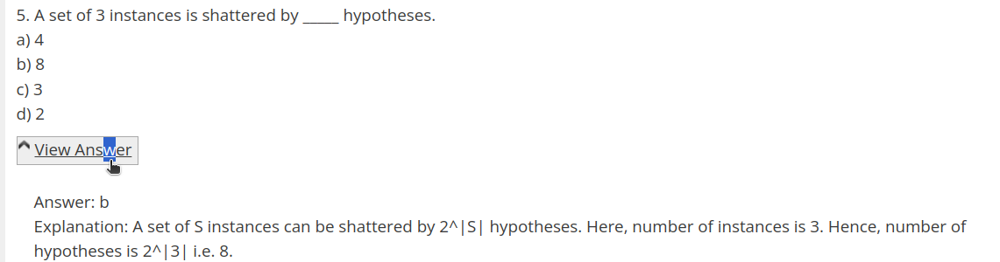
$$
VC(H) \leq \log_2|H|
$$
VC dimension can work for infinite hypothesis space, better than PAC

## Trees and Ensemble

**ID3**

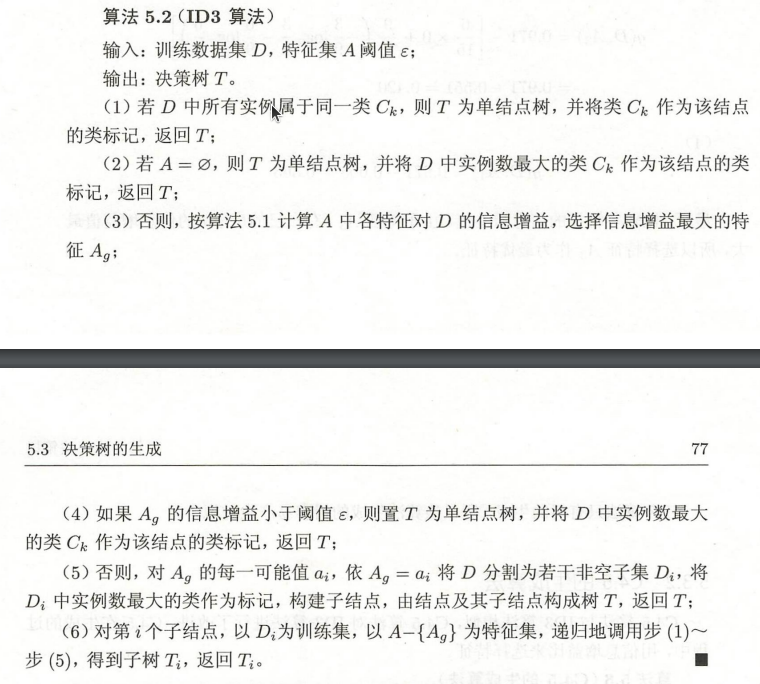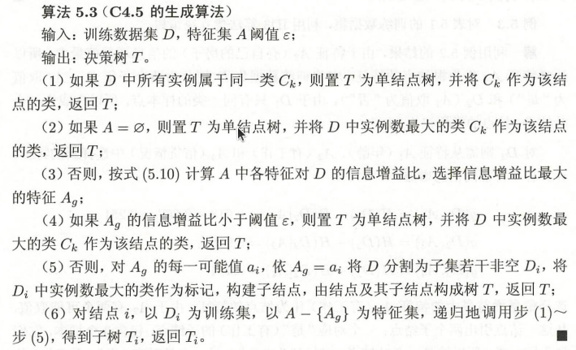

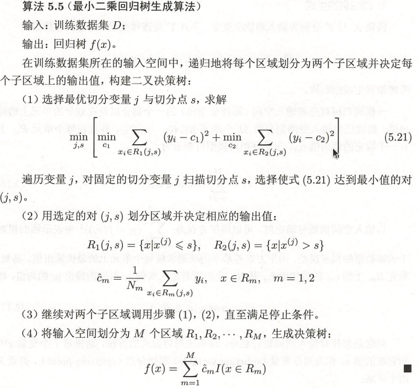

- 最小化KL散度等同于最小化交叉熵
- 

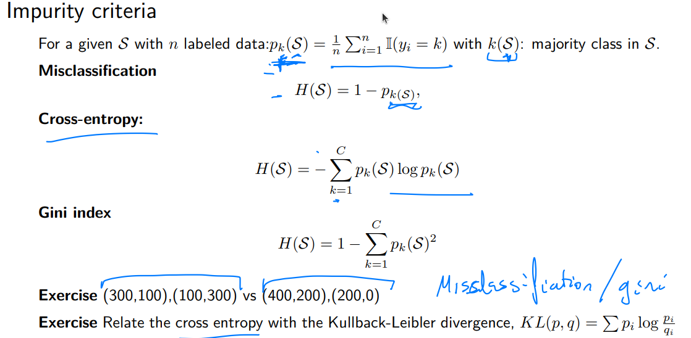

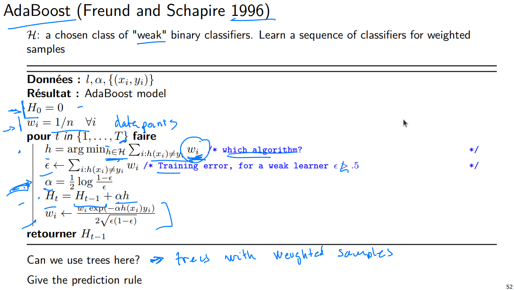

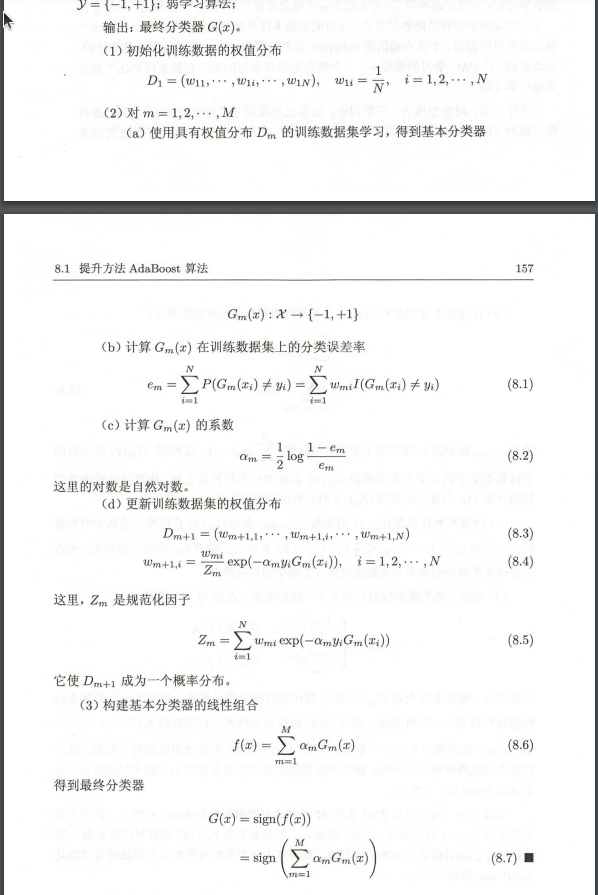

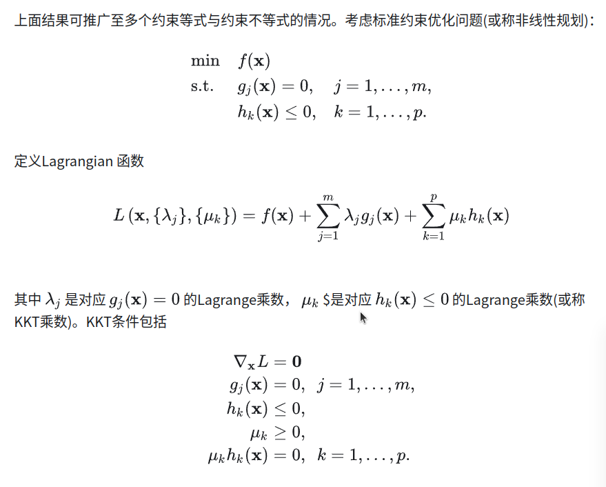

- Boosting is not a heterogeneous ensemble but is a homogeneous ensemble.
- If the classifier is unstable which means it has high variance, then we cannot apply boosting. We can use bagging if the classifier is unstable. If the classifier is steady and straightforward (high bias), then we have to apply boosting.
- The success of AdaBoost is due to its property of increasing the margin.

## SVM

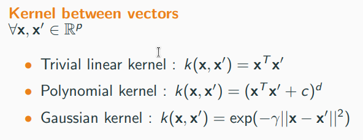

## N

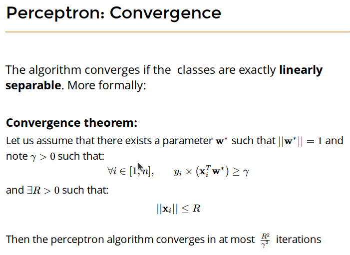

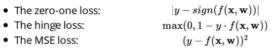

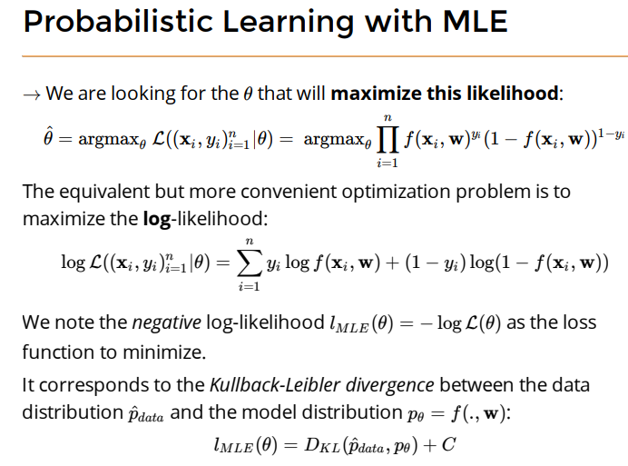

**conv layer output**
$$
o = \left \lfloor \frac{i + 2p -k}{s} \right \rfloor + 1
$$

## Some MCQ

https://www.sanfoundry.com/1000-machine-learning-questions-answers/

https://github.com/SamBelkacem/AI-ML-cheatsheets

https://www.ctanujit.org/uploads/2/5/3/9/25393293/cheatsheets.pdf

- Machine learning is the autonomous acquisition of knowledge through the use of computer programs.
- 

Which algorithm is best suited for a binary classification problem?

a) K-nearest Neighbors
b) Decision Trees
c) Random Forest
d) Linear Regression