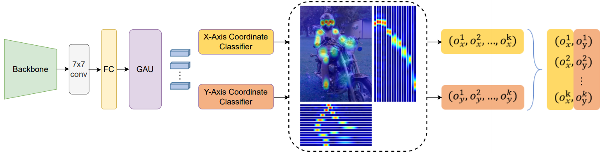
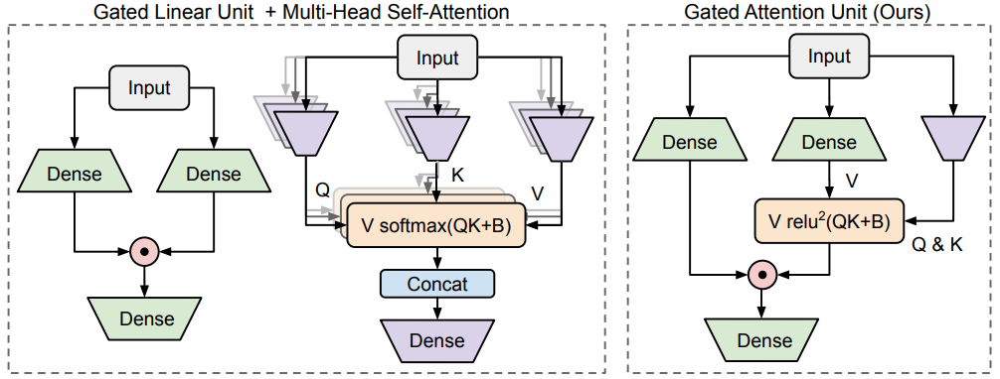
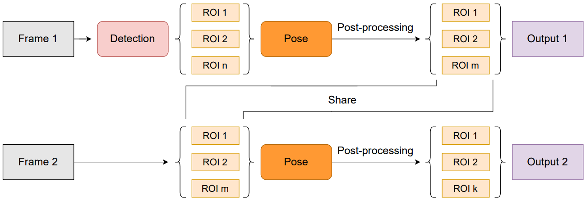
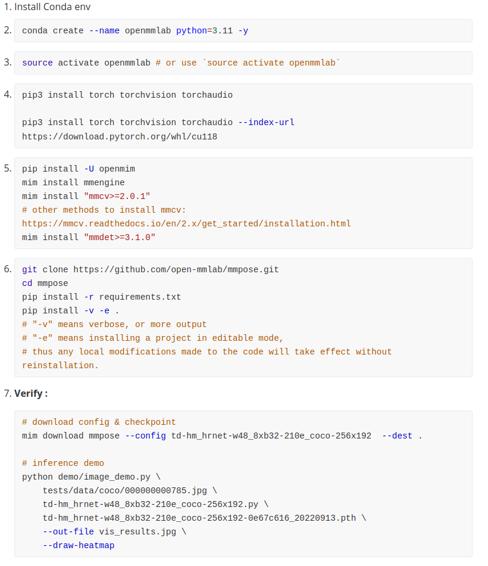
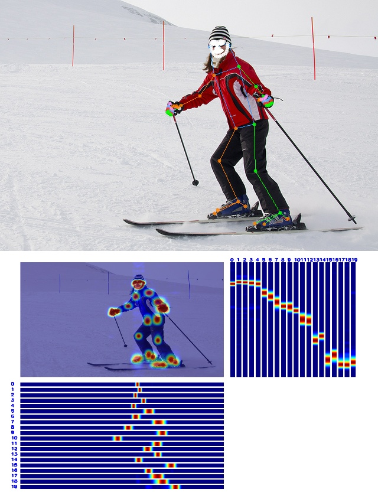

## Paper

- **RTMPose**: **R**eal-**T**ime **M**ulti-Person Pose Estimation based on MMPose

- **Overall architecture :**

  

  - Feature dimension = 256

  - Baseline: trimmed SimCC(no upsampling layers)

  - EMA

  - Gated Attention Unit(GAU)

  - GLU

    

  - Soft Labels for Ordinal Regression

---

- **Inference pipeline :**

  

  - skip-frame detection mechanism as in [BlazePose](https://arxiv.org/abs/2006.10204), human detection is performed every K frames

  - **Post-processing :** OKS-based pose NMS and OneEuro filter 

  - [1 euro filter demo](https://gery.casiez.net/1euro/InteractiveDemo/)

    

## Installation

<a href="https://mmpose.readthedocs.io/en/latest/installation.html"></a>

<span style="color:red;font-weight:bold">I met bug  on mmposeV1.3.1:</span>

```shell
RuntimeError: nms_impl: implementation for device cuda:0 not found.
```

<details>
    <summary>Not work for now</summary>
	
</details>

---

<span style="color:red;font-weight:bold">Debug Install</span>

1. Make sure the cuda-tool works, what I used is `NVIDIA-SMI 550.54.14`  and `cuda12.4`  <a href="https://developer.nvidia.com/cuda-downloads?target_os=Linux&target_arch=x86_64&Distribution=Ubuntu&target_version=22.04&target_type=deb_local"></a>

2. Change `~/.bashrc `  (Optional)

   ```shell
   export PATH="/usr/local/cuda-12.4/bin:$PATH"
   export LD_LIBRARY_PATH="/usr/local/cuda-12.4/lib64:$LIB_LIBRARY_PATH"
   ```

   Check it by `nvcc -V`

   ```shell
   $ nvcc -V
   nvcc: NVIDIA (R) Cuda compiler driver
   Copyright (c) 2005-2024 NVIDIA Corporation
   Built on Tue_Feb_27_16:19:38_PST_2024
   Cuda compilation tools, release 12.4, V12.4.99
   Build cuda_12.4.r12.4/compiler.33961263_0
   ```

3. <a href="https://docs.anaconda.com/free/miniconda/"></a>

4. Create an env and activate it. (It seems we can't execute in one line)

   ```shell
   # How to remove this env:
      # conda deactivate
      # conda remove --name openmmlab --all -y
   # Create:
   conda create --name openmmlab python=3.11 -y
   ```

   ```shell
   source activate openmmlab # or use `conda activate openmmlab`
   ```


5. <a href="https://pytorch.org/"></a>

   ```shell
   # Stable(2.2.1)-Linux-Pip-Python-CUDA12.1
   pip3 install torch torchvision torchaudio 
   ```

6. ```shell
   pip install -U openmim
   mim install mmengine
   mim install "mmcv>=2.0.1"
   # other methods to install mmcv: https://mmcv.readthedocs.io/en/2.x/get_started/installation.html
   mim install "mmdet>=3.1.0"
   ```

   > If you encounter version incompatibility issues, please check the correspondence using `pip list | grep mm` and upgrade or downgrade the dependencies accordingly. Please note that `mmcv-full` is only for `mmcv 1.x`, so please uninstall it first, and then use `mim install mmcv` to install `mmcv 2.x`.

7. ```shell
   git clone https://github.com/open-mmlab/mmpose.git
   cd mmpose
   pip install -r requirements.txt
   pip install -v -e .
   # "-v" means verbose, or more output
   # "-e" means installing a project in editable mode,
   # thus any local modifications made to the code will take effect without reinstallation.
   ```
   
3. **Verify :**

   ```shell
   # download config & checkpoint
   mim download mmpose --config td-hm_hrnet-w48_8xb32-210e_coco-256x192  --dest .
   
   # inference demo
   python demo/image_demo.py \
       tests/data/coco/000000000785.jpg \
       td-hm_hrnet-w48_8xb32-210e_coco-256x192.py \
       td-hm_hrnet-w48_8xb32-210e_coco-256x192-0e67c616_20220913.pth \
       --out-file vis_results.jpg \
       --draw-heatmap
   ```
   
   >Results:
   >
   >

9. **(Optional) test.py : check the availability of mmcv**

   ```python
   from mmcv.ops import batched_nms
   import torch
   
   def check_mmcv():
   
       device = torch.device('cuda:0')
   
       bboxes = torch.randn(2, 4, device=device)
       scores = torch.randn(2, device=device)
       labels = torch.zeros(2, dtype=torch.long, device=device)
       det_bboxes, keep_idxs = batched_nms(bboxes.to(torch.float32), scores.to(torch.float32), labels, {
           'type': 'nms',
           'iou_threshold': 0.6
       })
   
       print('OK.')
   
   
   if __name__ == '__main__':
       check_mmcv()
   
   ```


---


## Rtmpose on WholeBody 2d (133 Keypoints) = RtmW

**5 core files :**

- `topdown_demo_with_mmdet.py` 

- `rtmdet_m_640-8xb32_coco-person.py` (det_config)
- `rtmdet_m_8xb32-100e_coco-obj365-person-235e8209.pth` (det_checkpoint)
- `rtmw-x_8xb320-270e_cocktail14-384x288.py` (pose_config)
- `rtmw-x_simcc-cocktail14_pt-ucoco_270e-384x288-f840f204_20231122.pth` (pose_checkpoint)


**demo structure generator**

You can clone this repo or use script below: 

<a href=""></a>

```shell
# {MMPOSE_ROOT}: mmpose cloned from github
MMPOSE_ROOT="path/mmpose"
DEMO_ROOT="rtmw_2d133keys_demo"
mkdir -p \
    ${DEMO_ROOT}/ckpt \
    ${DEMO_ROOT}/config \
    ${DEMO_ROOT}/src \
    ${DEMO_ROOT}/output \
    ${DEMO_ROOT}/data

cp ${MMPOSE_ROOT}/demo/topdown_demo_with_mmdet.py \
	${DEMO_ROOT}/src/
	
cp ${MMPOSE_ROOT}/projects/rtmpose/rtmdet/person/rtmdet_m_640-8xb32_coco-person.py \
	${DEMO_ROOT}/config/
	
cp ${MMPOSE_ROOT}/projects/rtmpose/rtmpose/wholebody_2d_keypoint/rtmw-x_8xb320-270e_cocktail14-384x288.py \
	${DEMO_ROOT}/config/

# copy example image
cp ${MMPOSE_ROOT}/tests/data/coco/000000000785.jpg ${DEMO_ROOT}/data/
```


**Download checkpoints**

```shell
# download detector ckpt
wget -c -P ${DEMO_ROOT}/ckpt/ https://download.openmmlab.com/mmpose/v1/projects/rtmpose/rtmdet_m_8xb32-100e_coco-obj365-person-235e8209.pth

# donwload pose estimator ckpt
wget -c -P ${DEMO_ROOT}/ckpt/ https://download.openmmlab.com/mmpose/v1/projects/rtmw/rtmw-x_simcc-cocktail14_pt-ucoco_270e-384x288-f840f204_20231122.pth
```


**run.sh**

```shell
python ./src/topdown_demo_with_mmdet.py \
    ./config/rtmdet_m_640-8xb32_coco-person.py \
    ./ckpt/rtmdet_m_8xb32-100e_coco-obj365-person-235e8209.pth \
    ./config/rtmw-x_8xb320-270e_cocktail13-384x288.py \
    ./ckpt/rtmw-x_simcc-cocktail13_pt-ucoco_270e-384x288-0949e3a9_20230925.pth \
    --input ../data/000000000785.jpg \
    --output-root ./output \
    --draw-heatmap
```

---

---